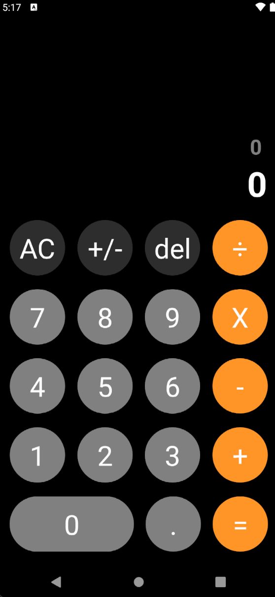
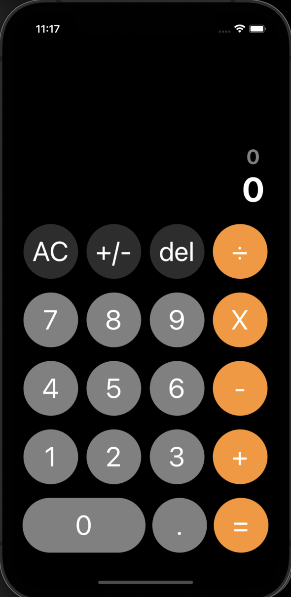

# Calculator

This is an APP that lets you do basic operations. Its just a practice focused on custom hooks, folders arquitecture and custom components. It is inspired by an activity from a Udemy course but it has improvements from personal criteria.

## Screenshots

### Android && IOS 

  
  

## Tools:
- React Native CLI
- TypeScript
- Custom Hooks

### Author

Lucas Pagliettini 2021